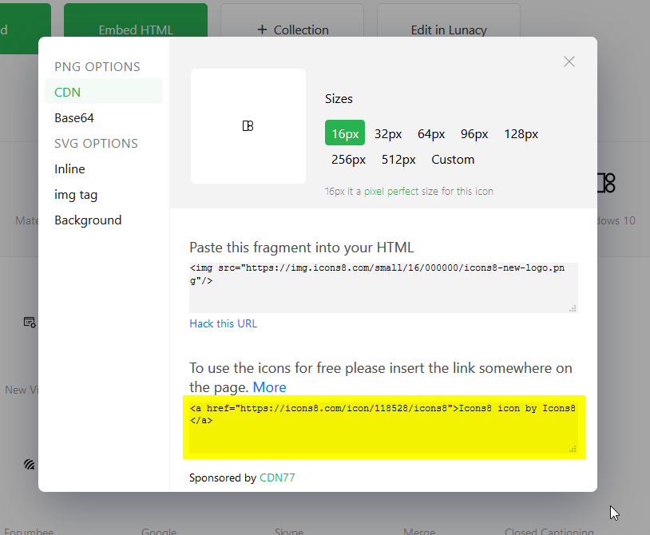
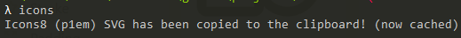

# Icons CLI

## Install
`npm i icons-cli -g`

## How-to guide for Icons8
1. Go to http://icons8.com/icon
2. Click on an icon to open the modal

3. Click on the code above "To use the icons for free please insert the link somewhere on the page". It will save it to your clipboard
4. Go to your console and simply type the command `icons`  


5. You now have the corresponding icon as a SVG in your clipboard!
6. Paste it, you should see your SVG code!
```html
<svg xmlns="http://www.w3.org/2000/svg" viewBox="0 0 16 16"><path d="M 2 1 C 1.4534686 1 1 1.4534686 1 2 L 1 13 C 1 13.546531 1.4534686 14 2 14 L 7 14 C 7.5465314 14 8 13.546531 8 13 L 8 12.939453 C 8.6363923 13.591524 9.5210318 14 10.5 14 C 12.427074 14 14 12.427074 14 10.5 C 14 9.2213921 13.300384 8.1108028 12.271484 7.5 C 13.300384 6.8891972 14 5.7786079 14 4.5 C 14 2.5729257 12.427074 1 10.5 1 C 9.5210318 1 8.6363923 1.4084764 8 2.0605469 L 8 2 C 8 1.4534686 7.5465314 1 7 1 L 2 1 z M 2 2 L 7 2 L 7 10.5 L 7 13 L 2 13 L 2 2 z M 10.5 2 C 11.886634 2 13 3.1133658 13 4.5 C 13 5.8866342 11.886634 7 10.5 7 C 9.1133658 7 8 5.8866342 8 4.5 C 8 3.1133658 9.1133658 2 10.5 2 z M 8 6.9394531 C 8.2148474 7.1595935 8.4625598 7.3421162 8.7285156 7.5 C 8.4625598 7.6578838 8.2148474 7.8404065 8 8.0605469 L 8 6.9394531 z M 10.5 8 C 11.886634 8 13 9.1133658 13 10.5 C 13 11.886634 11.886634 13 10.5 13 C 9.1133658 13 8 11.886634 8 10.5 C 8 9.1133658 9.1133658 8 10.5 8 z"/></svg>
```

## Supported icons
- Icons8 (free & pro - make sure to have the rights to use it - don't need to be logged)

## Cache
All lookup icons are cached locally.